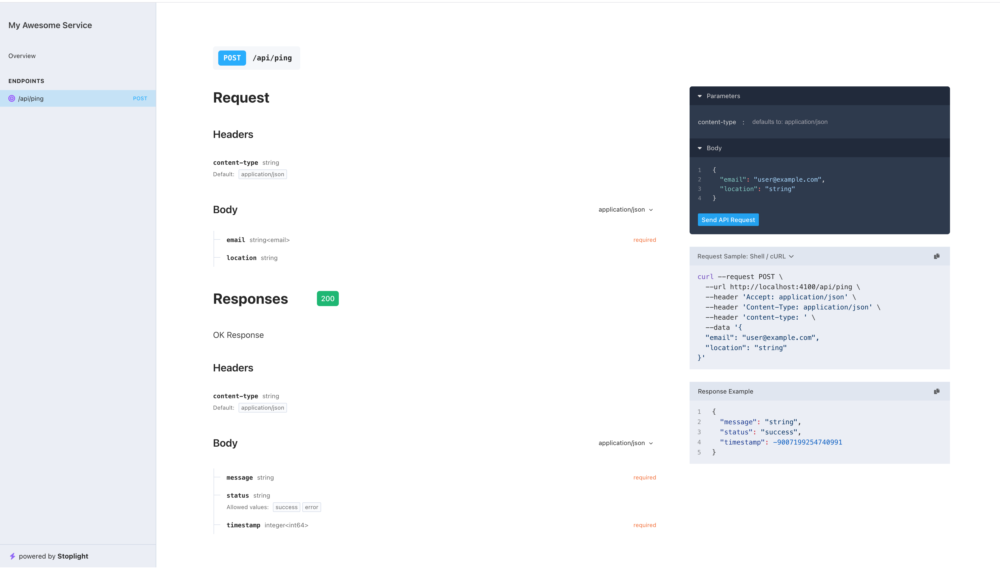

# gofi (In Development)

Gofi is an openapi 3 schema-first router for Golang.

Installation
```go
go get -u github.com/michaelolof/gofi
```

Example
```go
import (
	"net/http"
	"time"

    "github.com/michaelolof/gofi"
	"github.com/rs/cors"
)


type PingOkBody struct {
	Status    string `json:"status" validate:"oneof=success,error"`
	Message   string `json:"message" validate:"required"`
	TimeStamp int    `json:"timestamp" validate:"required"`
}

type pingSchema struct {
	Request struct {
		Body struct {
			Email    string `json:"email" validate:"required,email"`
			Location string `json:"location" validate:"min=10"`
		}
	}

	Ok struct {
		Header struct {
			ContentType string `json:"content-type" default:"application/json"`
		}

		Body PingOkBody `validate:"required"`
	}
}

var PingHandler = gofi.DefineHandler(gofi.RouteOptions{

	Schema: &pingSchema{},

	Handler: func(c gofi.Context) error {
		s, err := gofi.ValidateAndBind[pingSchema](c)
		if err != nil {
			return err
		}

		// Access user email and location
		email := s.Request.Body.Email
		location := s.Request.Body.Location
		fmt.Printf("User %s pinging from %s\n", email, location)

		s.Ok.Body = PingOkBody{
			Status:    "success",
			Message:   "Awesome service up and grateful",
			TimeStamp: int(time.Now().Unix()),
		}

		return c.JSON(200, s.Ok)
	},
})
	
func main() {
    
    mux := gofi.NewServeMux()

    err := gofi.ServeDocs(r, gofi.DocsOptions{
		Info: gofi.DocsInfoOptions{
			Title:       "My Awesome Service",
			Version:     "0.0.1",
			Description: "An extremely awesome service",
		},
		Views: []gofi.DocsView{
			{
				RoutePrefix: "/api-docs",
				Template:    gofi.StopLight(),
			},
		},
	})
	if err != nil {
		log.Fatalln(err)
	}

	r.Use(cors.AllowAll().Handler)

    r.GET("/api/ping", PingHandler)

	http.ListenAndServe(":4100", mux)
}   
```

Openapi 3 documentation is served at http://localhost:4200/api-docs
gofi will generate an openapi3 documentation with request and response validations based on the schema struct defined.



**Please note:** gofi is still in development and APIs are subject to change. Do not use in production.